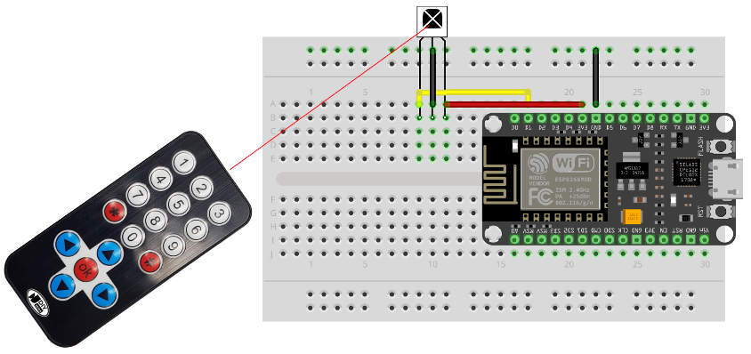

s# Invisible Technology: Hacking with Infrared Workshop

Infrared (IR) is a truly invisible technology, yet it powers many of the devices we use every day—from TV remotes and motion detectors to robots and security systems.

In this hands-on workshop, you’ll uncover the hidden world of infrared communication. Using Arduino, you’ll learn how IR signals are sent and received, visualize invisible signals on your computer, and use them to control real-world devices.

This workshop blends electronics, coding, and ethical hacking to show how everyday technology really works.

Recommended Age - 12+  \
Skill Level - Beginner-friendly (no prior Arduino experience required) \
Approx. Cost - $9-20 per student (hardware varies)

[Slides](https://bit.ly/infrared-kidzmash-2026)

## Labs

1. Getting Started
    1. [Prerequisites](docs/prerequisites.md)
    1. [Configure](docs/config.md)
1. [Arduino Fundamentals](docs/arduino.md)
    1. [Serial](docs/serial.md)
    1. [LEDs](docs/leds.md)
    1. [Buttons](docs/buttons.md)
1. [Infrared Hacking](docs/infrared.md)
    1. [Receive IR](docs/receive_ir.md)
    1. [Transmit IR](docs/transmit_ir.md)
    1. [Proximity & Detection](docs/proximity.md)