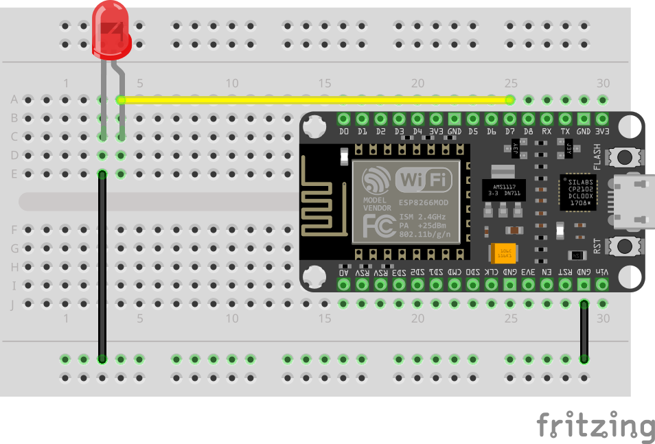

# LEDs


## Lab: Blink an External LED

In this lab you’ll wire an external LED to the NodeMCU and blink it once per second.



### Wiring Table (source → destination)

NodeMCU GND → – rail
NodeMCU D2 (GPIO4) → LED anode (long leg)
LED cathode (short leg) → – rail

✅ The LED is powered directly from the GPIO pin (D2).
⚠️ Use a resistor (typically 220Ω–330Ω) to protect the LED and the NodeMCU pin.

### Step-by-step

1. Connect ground (the “return path”)

    1. Run a jumper wire from NodeMCU GND to the breadboard – rail (ground rail).
        * This matches the black wire in the image going down to the rail.

1. Place the LED
    1. Insert the LED into the breadboard near the left side.
    1. Make sure the LED legs are in different rows (not the same connected row).
    1. Identify the legs:
        * Anode = long leg (+)
        * Cathode = short leg (–) and/or the flat side of the LED body

1.  Wire D2 to the LED anode
    1. Connect a jumper wire from NodeMCU D2 to the LED anode (long leg) row.
        * This matches the long yellow wire in the image.

1. Wire LED cathode to ground
    1. Connect the LED cathode (short leg) row to the - rail.

### Code

```c++:../code/Blink_External_LED.ino

```

### Upload and Test
1. Upload the sketch
    1. In Arduino IDE, select the correct board (commonly NodeMCU 1.0 (ESP-12E Module)).
    1. Select the correct Port.
    1. Click Upload.
1.  Verify it works
    * Your external LED should blink on/off every second.