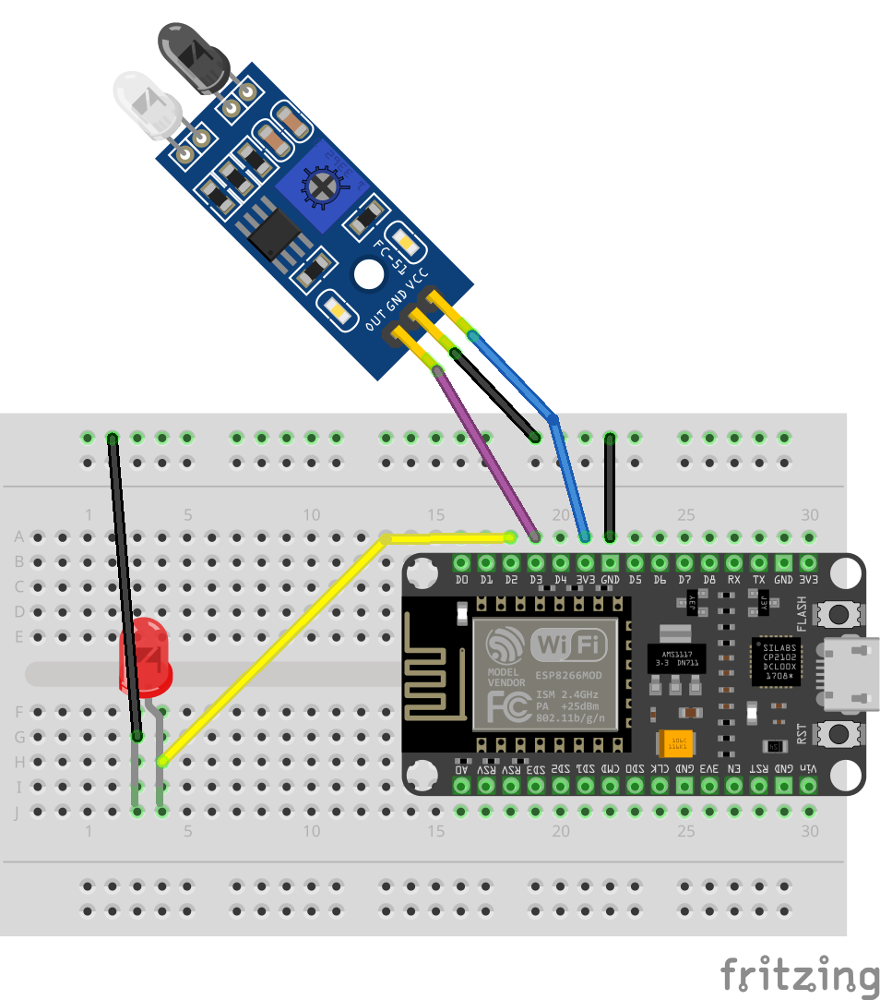

# IR Proximity / Object Detector

Infrared proximity sensors detect nearby objects using invisible IR light. The sensor emits infrared light and watches for reflections. When something is close, the sensor’s output changes, allowing your NodeMCU to react—like turning on an LED when an object is detected.

## Lab: IR Proximity / Object Detector

In this lab, you’ll wire an IR obstacle/proximity sensor module (often labeled HW-201 or similar) to your NodeMCU and use it to control an external LED. When an object is detected in front of the sensor, the LED will turn on.



### Wiring Table (source → destination)

NodeMCU 3V3 → IR proximity sensor VCC (+)\
NodeMCU GND → - rail\
IR proximity sensor GND (–) → - rail\
NodeMCU D3 (GPIO0) → IR proximity sensor OUT / DO\

NodeMCU D2 (GPIO4) → LED anode (long leg)\
LED cathode (short leg) → - rail

> 💡 Many IR proximity modules include a small adjustment screw (potentiometer). Turning it changes the detection distance/sensitivity.

### Code

```c++
#define LED D2 // GPIO4 (D2)
#define SENSOR_PIN D3 // GPIO0 (D3)

void setup() {
  Serial.begin(115200);
  delay(200);
  pinMode(LED, OUTPUT);
  pinMode(SENSOR_PIN, INPUT);
}

void loop() {
  int state = digitalRead(SENSOR_PIN);

  if (state == LOW) {
    digitalWrite(LED, HIGH);
    Serial.println("The obstacle is present");
  } else {
    digitalWrite(LED, LOW);
    Serial.println("The obstacle is NOT present");
  }

  delay(100);
}
```

[IR_Proximity.ino](https://github.com/cjudd/hacking-infrared-workshop/blob/main/code/IR_Proximity.ino)

This sketch reads the sensor’s digital output on D3 and uses it to control an LED on D2. The program continuously checks the sensor state. When the sensor output is LOW, the code treats that as “object detected” and turns the LED on. When the sensor output is HIGH, the code turns the LED off. The loop runs repeatedly with a short delay so the LED responds quickly as objects move in and out of range.

### Upload and Test

1. Upload the sketch
    1. In Arduino IDE, select the correct board (commonly NodeMCU 1.0 (ESP-12E Module)).
    1. Select the correct Port.
    1. Click Upload.
1.  Verify it works
    * Object close → LED turns ON
    * Object removed → LED turns OFF
1. If your sensor has an adjustment screw:
    * Turn it slightly and retest until detection is reliable at the distance you want.

### Troubleshooting

* LED never turns on
    * Flip the LED (it may be reversed).
    * Confirm LED wiring: D2 → anode, cathode → GND.
    * Confirm the sensor’s OUT wire is on D3.
* LED stays on all the time
    * Some modules output the opposite logic. If so, invert the check:
        * Change if (state == LOW) to if (state == HIGH)
    * Reduce sensitivity using the adjustment screw.
* Sensor never detects anything
    * Double-check sensor pin labels: OUT, GND, VCC (order can vary).
    * Try moving the object much closer (start 1–2 inches away).
    * Adjust the sensitivity screw slowly (small turns).

---

1. [Receive IR](receive_ir.md)
1. [Transmit IR](transmit_ir.md)
1. [Proximity & Detection](proximity.md)
