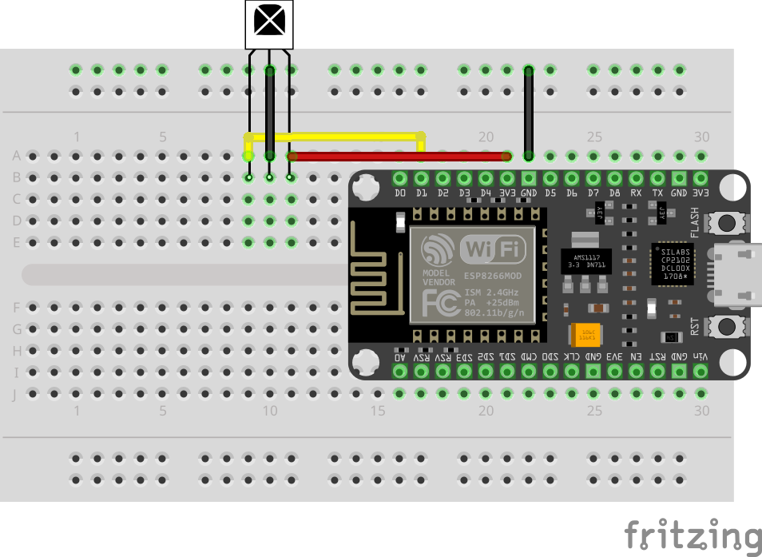
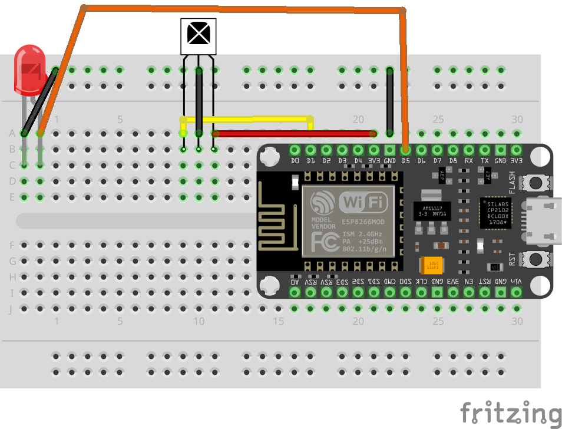
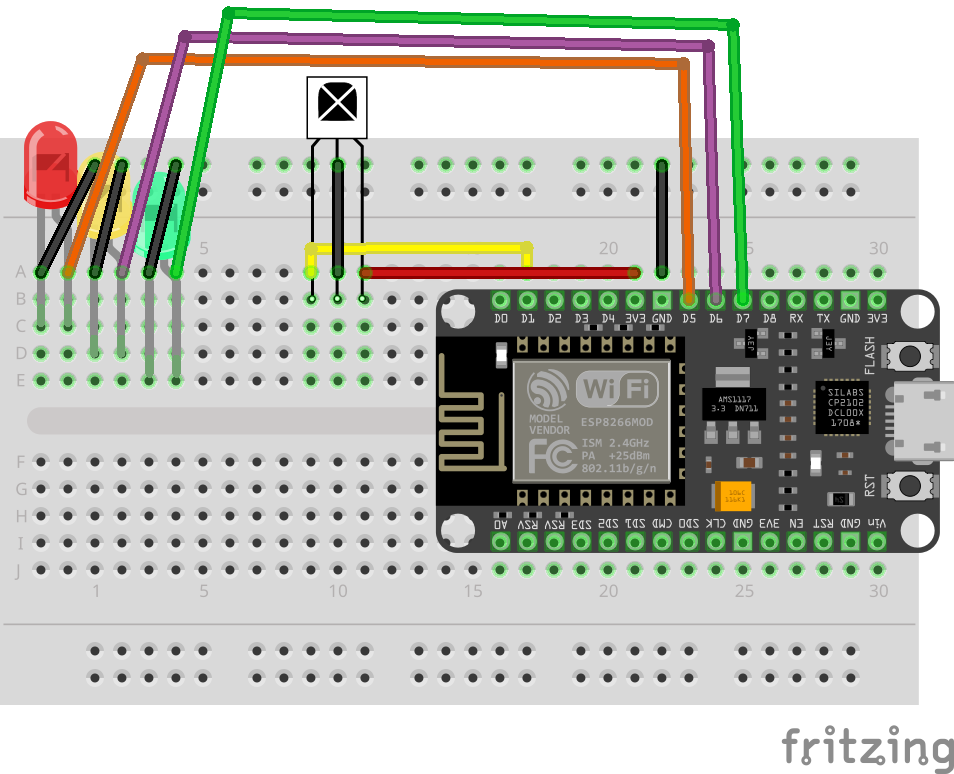

# Receiving Infrared (IR) Signals

In this lab, you’ll learn how to receive and read infrared (IR) signals using an Arduino-compatible board. Infrared signals are all around us—every time you press a button on a TV remote, it sends a burst of invisible light that carries information. Your goal in this lab is to capture those invisible signals and turn them into data your code can understand.

You’ll connect an IR receiver to your board and use code to listen for incoming signals. When an IR signal is detected, the receiver converts the invisible light into an electrical signal that the Arduino can read. From there, your program can print out information about the signal or react to it—just like real devices do.

This lab is an important step because it shows how Arduino can act as a listener instead of just a controller. Instead of sending signals out, you’ll be reading signals coming in and responding to them. This is the same basic technique used in remote controls, security systems, and many smart devices.

By the end of this lab, you’ll be able to:

* Capture IR signals from a remote control
* See that invisible light can carry data
* Understand how hardware and software work together to decode signals

This sets the foundation for more advanced projects, like building a universal remote or triggering actions based on infrared input.

## Lab: Log Received IR Signals

In this lab, you will connect an IR receiver module to the NodeMCU and read IR signals from a remote control. You’ll confirm the receiver is working by viewing decoded output in the Serial Monitor.



### Wiring Table (source → destination)

NodeMCU 3V3 → IR receiver VCC (+)\
NodeMCU GND → - rail\
IR receiver GND (–) → - rail\
NodeMCU D1 (GPIO5) → IR receiver OUT / SIG\

💡 Most IR receiver modules have 3 pins: VCC, GND, and OUT (sometimes labeled SIG).
If your receiver is a bare 5mm sensor, use the module pinout provided with your kit—modules are strongly recommended for this lab.

### Code

```c++
#include <IRremoteESP8266.h>
#include <IRrecv.h>
#include <IRutils.h>

#define RECV_PIN D1 // GPIO5 D1

IRrecv irrecv(RECV_PIN);
decode_results results;

void setup() {
  Serial.begin(115200);
  irrecv.enableIRIn();
  delay(200);
  Serial.println("Waiting for IR input...");
}

void loop() {
  if (irrecv.decode(&results)) {
    Serial.println("****** Received IR input ******");
    print("Hex", resultToHexidecimal(&results));
    print("Human Readable", resultToHumanReadableBasic(&results));
    print("Source Code", resultToSourceCode(&results));
    print("Timing", resultToTimingInfo(&results));
    irrecv.resume();
  }
}

void print(String title, String body) {
  Serial.println("**** " + title + " ****");
  Serial.println(body);
}
```

[IR_Receiver_Verbose.ino](https://github.com/cjudd/hacking-infrared-workshop/blob/main/code/IR_Receive_Verbose.ino)

This sketch turns your NodeMCU into an IR “listener.” It sets up an `IRrecv` object on pin D1 and starts the IR receiver using `enableIRIn()`. Inside the `loop()`, the code checks whether a complete IR message has been received using `decode()`. When a signal is detected, it prints the same capture in several formats: a hex value (compact ID), a human-readable interpretation (protocol + command when possible), a source-code representation you can copy/paste later to replay the signal, and timing details that show the pulse pattern. After printing, `resume()` tells the receiver to get ready for the next signal.

### Upload and Test

1. Upload the sketch
    1. In Arduino IDE, select the correct board (commonly NodeMCU 1.0 (ESP-12E Module)).
    1. Select the correct Port.
    1. Click Upload.
1.  Verify it works
    1. Point provided (or any IR) remote at the IR receiver and press a button
    1. Observe the output blocks
        * Hex
        * Human Reable
        * Source Code
        * Timing
1. Press different buttons and confirm you get different values.

### Troubleshooting

* Nothing prints when you press remote buttons
    * Make sure the receiver OUT/SIG pin goes to D1 (not 3V3 or GND).
    * Confirm the receiver is powered from 3V3
    * Try a different remote (some remotes use different protocols, but most should still show something).
    * Move the remote closer (start within 6–12 inches).
* You see “Waiting for IR input…” but still no output
    * Double-check the receiver pin order—some modules swap VCC/GND/OUT depending on orientation.
    * Try shielding from bright sunlight (strong IR from sunlight can interfere).
* Output looks messy or inconsistent
    * Avoid fluorescent lighting and direct sunlight.
    * Keep the remote pointed at the receiver and press buttons firmly.
    * Some remotes send a “repeat” code when held down—try single taps.

## Lab: Control an LED with an IR Remote

In this lab, you’ll use an IR remote control to toggle an external LED on and off. Your NodeMCU will “listen” for a specific IR button press, recognize the IR code, and then flip the LED state each time that button is pressed.



### Wiring Table (source → destination)

NodeMCU 3V3 → IR receiver VCC (+)\
NodeMCU GND → - rail\
IR receiver GND (–) → - rail\
NodeMCU D1 (GPIO5) → IR receiver OUT / SIG\
NodeMCU D5 (GPIO14) → LED anode (long leg)\
LED cathode (short leg) → - rail

### Code

```c++
#include <IRremoteESP8266.h>
#include <IRrecv.h>
#include <IRutils.h>

#define LED 14 // GPIO14 D5
#define RECV_PIN D1 // GPIO5 D1

unsigned long IR_CODE_1 = 0xFFA25D;
bool status;

IRrecv irrecv(RECV_PIN);
decode_results results;

void setup() {
  Serial.begin(115200);
  irrecv.enableIRIn();
  pinMode(LED, OUTPUT);
  delay(200);
  Serial.println("Waiting for IR input...");
}

void loop() {
  if (irrecv.decode(&results)) {
    if(results.value == IR_CODE_1) {
      status = light("LED", LED, status);
    }
    delay(300);
    irrecv.resume();
  }
}

bool light(String name, uint16_t led, bool status) {
  if(status) {
    Serial.println(name + " off");
    digitalWrite(led, LOW);
  } else {
    Serial.println(name + " On");
    digitalWrite(led, HIGH);
  }
  return !status;
}
```

[IR_Remote_LED.ino](https://github.com/cjudd/hacking-infrared-workshop/blob/main/code/IR_Remote_LED.ino)

This sketch connects an IR receiver to pin D1 and an LED to pin D5 (GPIO14). The code constantly checks for incoming IR signals. When a signal is received, it compares the decoded value to a specific button code (0xFFA25D). If the code matches, it calls the light() function, which toggles the LED: if the LED is currently on, it turns it off; if it’s off, it turns it on. The status variable remembers the LED’s current state so each button press flips it to the opposite state.

### Upload and Test

1. Upload the sketch
    1. In Arduino IDE, select the correct board (commonly NodeMCU 1.0 (ESP-12E Module)).
    1. Select the correct Port.
    1. Click Upload.
1.  Verify it works
    1. Point your IR remote at the IR receiver.
    1. Press the button on your remote that sends the code `0xFFA25D`.
    1. Each time you press the button, the LED should toggle:
        * First press: LED turns on
        * Next press: LED turns off
        * Repeat
        * Serial Monitor should print “LED on”

### Troubleshooting

* LED never turns on
    * Flip the LED (anode/cathode might be reversed).
    * Confirm the LED is wired to D5 (GPIO14) and not another pin.
* IR receiver doesn’t detect anything
    * Confirm IR receiver pin order: VCC → 3V3, GND → GND, OUT → D1.
    * Try moving the remote closer (start 6–12 inches away).
    * Avoid direct sunlight or strong overhead lighting.
* Remote button doesn’t toggle LED
    * Your remote may send a different code than 0xFFA25D.
    * Run the Receive IR lab, press your desired button, and copy the hex code into:
        * `unsigned long IR_CODE_1 = 0x...;`
* LED toggles multiple times per press
    * Some remotes send repeat signals. Increase the delay (e.g., delay(500)) or add logic to ignore repeats.

## Lab: Control Multiple LEDs with an IR Remote

You will wire an IR receiver plus three LEDs (red, yellow, green) as shown in the diagram. Then you’ll upload a sketch that toggles each LED using three different remote buttons (three different IR codes).



### Wiring Table (source → destination)

NodeMCU 3V3 → IR receiver VCC (+)\
NodeMCU GND → - rail\
IR receiver GND (–) → - rail\
NodeMCU D1 (GPIO5) → IR receiver OUT / SIG\

NodeMCU D5 (GPIO14) → **Red LED** anode (long leg)\
Red LED cathode (short leg) → - rail\

NodeMCU D6 (GPIO12) → **Yellow LED** anode (long leg)\
Yellow LED cathode (short leg) → - rail\

NodeMCU D7 (GPIO13) → **Green LED** anode (long leg)\
Green LED cathode (short leg) → - rail

### Code

```c++
#include <IRremoteESP8266.h>
#include <IRrecv.h>
#include <IRutils.h>

#define RED_LED 14 // GPIO14 D5
#define YELLOW_LED 12 // GPIO12 D6
#define GREEN_LED 13 // GPIO13 D7

#define RECV_PIN D1 // GPIO5 D1

unsigned long IR_CODE_1 = 0xFFA25D;
unsigned long IR_CODE_2 = 0xFF629D;
unsigned long IR_CODE_3 = 0xFFE21D;

bool redStatus;
bool yellowStatus;
bool greenStatus;

IRrecv irrecv(RECV_PIN);
decode_results results;

void setup() {
  Serial.begin(115200);
  irrecv.enableIRIn();
  pinMode(RED_LED, OUTPUT);
  pinMode(YELLOW_LED, OUTPUT);
  pinMode(GREEN_LED, OUTPUT);
  delay(200);
  Serial.println("Waiting for IR input...");
}

void loop() {

  if (irrecv.decode(&results)) {
    if(results.value == IR_CODE_1) {
      redStatus = light("Red", RED_LED, redStatus);
    }
    if(results.value == IR_CODE_2) {
      yellowStatus = light("Yellow", YELLOW_LED, yellowStatus);
    }
    if(results.value == IR_CODE_3) {
      greenStatus = light("Green", GREEN_LED, greenStatus);
    }

    delay(300);
    irrecv.resume();
  }
}

bool light(String name, uint16_t led, bool status) {
  if(status) {
    Serial.println(name + " off");
    digitalWrite(led, LOW);
  } else {
    Serial.println(name + " On");
    digitalWrite(led, HIGH);
  }
  return !status;
}
```

[IR_Remote_Stop_Light.ino](https://github.com/cjudd/hacking-infrared-workshop/blob/main/code/IR_Remote_Stop_Light.ino)

This sketch configures the IR receiver on pin D1 and sets three GPIO pins (D5, D6, D7) as outputs for three LEDs. In the `loop()`, the code waits for an IR signal to be decoded. When a signal arrives, it compares the received value to three known IR codes. If a match is found, it calls the `light()` function for the matching LED. The `light()` function toggles that LED: if it was on, it turns it off; if it was off, it turns it on. Separate status variables keep track of each LED so all three can be controlled independently.

### Upload and Test

1. Upload the sketch
    1. In Arduino IDE, select the correct board (commonly NodeMCU 1.0 (ESP-12E Module)).
    1. Select the correct Port.
    1. Click Upload.
1.  Verify it works
    1. Point your IR remote at the IR receiver and press the three buttons that produce:
        * `0xFFA25D` → toggles Red
        * `0xFF629D` → toggles Yellow
        * `0xFFE21D` → toggles Green
    1. Verify each LED toggles independently:
        * Press “Red button” → only red changes
        * Press “Yellow button” → only yellow changes
        * Press “Green button” → only green changes

💡 If your remote uses different codes, run the Receive IR lab first, press three buttons you want, and replace IR_CODE_1, IR_CODE_2, IR_CODE_3 with your captured values.

--- 

1. [Receive IR](receive_ir.md)
1. [Transmit IR](transmit_ir.md)
1. [Proximity & Detection](proximity.md)

[NEXT](transmit_ir.md)
