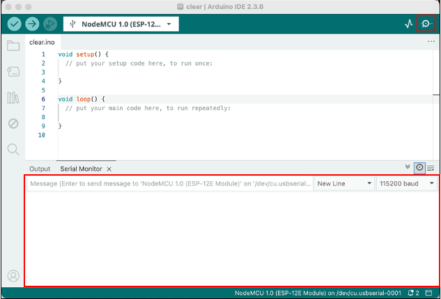

# Serial

In Arduino, Serial is a communication mechanism that sends text output from the board to your computer over USB, making it easier to observe program flow and debug execution.

## Lab: Serial

In this lab, you will set up the Serial port and use printed messages to see the order and timing of the `setup()` and `loop()` functions as your program runs.

### Wiring Table (source → destination)

Nothing to wire. LED is embedded in the board

### Code

```c++
void setup() {
  Serial.begin(115200);  
  delay(200);
  Serial.println("Setup");
}

void loop() {
  Serial.println("Hello World");
  delay(2000);
}
```

[SerialOutput.ino](https://github.com/cjudd/hacking-infrared-workshop/blob/main/code/SerialOutput.ino)

This program demonstrates how the Arduino runs code in the `setup()` and `loop()` functions and uses Serial messages to show what is happening. When the board first powers on or the code is uploaded, the `setup()` function runs once. Inside `setup()`, Serial communication is started at a speed of 115200 baud, the program waits briefly to allow the connection to stabilize, and then prints the message “Setup” to the Serial Monitor. After `setup()` finishes, the Arduino repeatedly runs the `loop()` function. Each time through the loop, the program prints “Hello World” to the Serial Monitor, waits for 2000 milliseconds or two seconds, and then repeats the process. This makes it easy to see that `setup()` runs only once, while `loop()` continues to run over and over again.

### Upload and Test
1. Upload the sketch
    1. In Arduino IDE, select the correct board (commonly NodeMCU 1.0 (ESP-12E Module)).
    1. Select the correct Port.
    1. Click Upload.
1.  Verify it works
    1. In the Arduino IDE, click the Serial Monitor button (magnifying glass icon) in the top-right corner.
    
    1. In the Serial Monitor window, set the baud rate to match your code (for example, 115200).
    1. Watch the messages appear and verify they match what your program is printing.

---

1. [Serial](serial.md)
1. [LEDs](leds.md)
1. [Buttons](buttons.md)

[NEXT](leds.md)