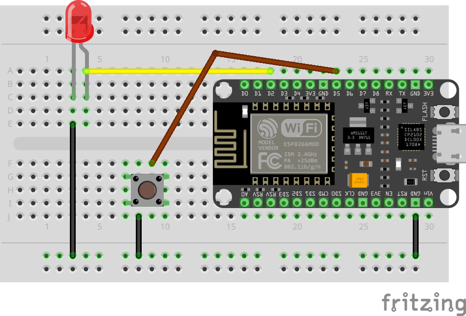

write a step by step lab for <infrared receiving> based on the attached image and this code and output in markdown format.

<code>
#include <IRremoteESP8266.h>
#include <IRsend.h>

#define BUTTON_1_PIN D5 // GPIO14 (D5) 
#define BUTTON_2_PIN D6 // GPIO12 (D6) 
#define IR_LED D2 // GPIO4 (D2)

IRsend irsend(D2);

void setup() {
  Serial.begin(115200);
  delay(200);  
  irsend.begin();
  pinMode(BUTTON_1_PIN, INPUT_PULLUP);
  pinMode(BUTTON_2_PIN, INPUT_PULLUP);
}

void loop() {
  int button1Value = digitalRead(BUTTON_1_PIN);
  if (button1Value == LOW){
    irsend.sendNEC(0xFFA25D); // Red
    Serial.println("Button 1");
   }
  int button2Value = digitalRead(BUTTON_2_PIN);
  if (button2Value == LOW){
    irsend.sendNEC(0xFF629D); // Yellow
    Serial.println("Button 2");
   }
   delay(500);
}
</code>

Use the following template.

<template>

# <title>

<description>

## Lab: <lab title>

<lab description>



### Wiring Table (source → destination)

<wiring format example>
NodeMCU GND → – rail\
NodeMCU D2 (GPIO4) → LED anode (long leg)\
LED cathode (short leg) → – rail\
NodeMCU D5 (GPIO14) → one side of pushbutton\
Other side of pushbutton → – rail
</wiring format example>

### Code

```c++
<insert code here>
```

[Button_LED.ino](https://github.com/cjudd/hacking-infrared-workshop/blob/main/code/Button_LED.ino)

<code description in paragraph form but exclude serial explination>

### Upload and Test

<step by step instructions>

### Troubleshooting

<troubleshooting>

---

1. [Receive IR](receive_ir.md)
1. [Transmit IR](transmit_ir.md)
1. [Proximity & Detection](proximity.md)

[NEXT](receive_ir.md)

</template>