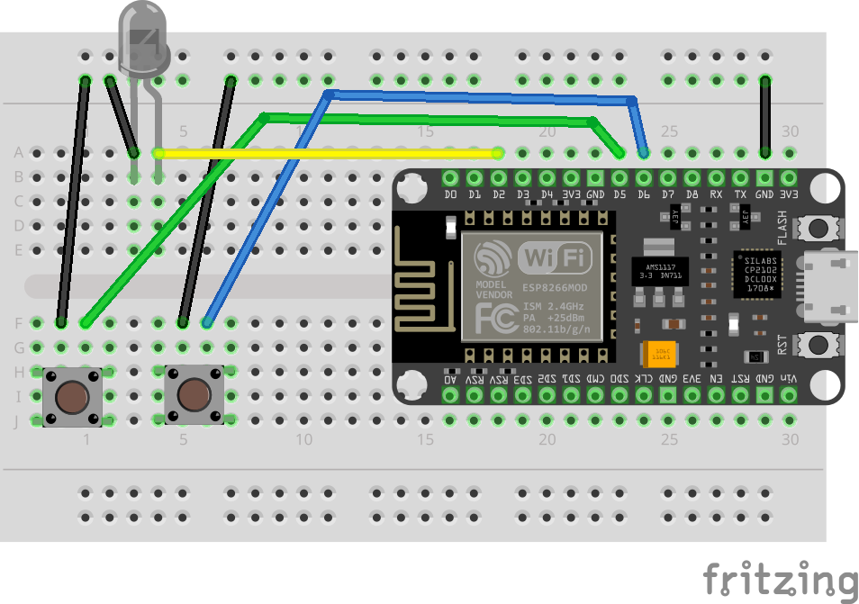

# Transmit IR

In this lab, you’ll turn your NodeMCU into a simple IR transmitter. Instead of using a normal TV remote, you’ll press two physical buttons on your breadboard to send two different IR commands using an IR LED. This is a great step toward building a custom remote control, automation button box, or “IR hacking” tool.

## Lab: IR Remote Control

You will wire a clear IR LED and two pushbuttons to your NodeMCU. When you press Button 1, the board sends one IR code. When you press Button 2, it sends a different IR code. Another IR receiver (from the “Receive IR” lab) can detect and decode these codes.



### Wiring Table (source → destination)

NodeMCU GND → – rail\
NodeMCU D2 (GPIO4) → IR LED anode (long leg)\
IR LED cathode (short leg) → – rail\

NodeMCU D5 (GPIO14) → one side of **Button 1**\
Other side of **Button 1** → – rail\

NodeMCU D6 (GPIO12) → one side of **Button 2**\
Other side of **Button 2** → – rail

### Code

```c++
#include <IRremoteESP8266.h>
#include <IRsend.h>

#define BUTTON_1_PIN D5 // GPIO14 (D5) 
#define BUTTON_2_PIN D6 // GPIO12 (D6) 
#define IR_LED D2 // GPIO4 (D2)

IRsend irsend(D2);

void setup() {
  Serial.begin(115200);
  delay(200);  
  irsend.begin();
  pinMode(BUTTON_1_PIN, INPUT_PULLUP);
  pinMode(BUTTON_2_PIN, INPUT_PULLUP);
}

void loop() {
  int button1Value = digitalRead(BUTTON_1_PIN);
  if (button1Value == LOW){
    irsend.sendNEC(0xFFA25D); // Red
    Serial.println("Button 1");
   }
  int button2Value = digitalRead(BUTTON_2_PIN);
  if (button2Value == LOW){
    irsend.sendNEC(0xFF629D); // Yellow
    Serial.println("Button 2");
   }
   delay(500);
}
```

[IR_Remote_Control_2_Button.ino](https://github.com/cjudd/hacking-infrared-workshop/blob/main/code/IR_Remote_Control_2_Button.ino)

This sketch configures two pins (D5 and D6) as button inputs using `INPUT_PULLUP`, which makes the pin read HIGH normally and LOW when the button is pressed (because the button connects the pin to ground). It also sets up an IR transmitter on pin D2. In the main loop, the program checks each button. If Button 1 is pressed, it transmits an IR command using the NEC protocol with the value `0xFFA25D`. If Button 2 is pressed, it transmits a different NEC command, `0xFF629D`. This repeats continuously, allowing the buttons to act like two remote-control buttons.

### Upload and Test

1. Upload the sketch
    1. In Arduino IDE, select the correct board (commonly NodeMCU 1.0 (ESP-12E Module)).
    1. Select the correct Port.
    1. Click Upload.
1.  Verify it works
    1. Aim this lab’s IR LED toward the receiver (start 2–6 inches apart).
    1. Press Button 1 → the receiver should decode a code matching 0xFFA25D.
    1. Press Button 2 → the receiver should decode a code matching 0xFF629D.

### Troubleshooting

* Receiver doesn’t detect anything
    * Make sure the IR LED polarity is correct:
        * Long leg (anode) → D2
        * Short leg (cathode) → resistor → GND
    * Make sure you called irsend.begin(); (it’s in the code).
    * Move the transmitter closer to the receiver and aim it directly.
    * Use phone camera to make sure LED is lighting up
* Buttons don’t trigger anything
    * Ensure each button plugged into different rows.
    * Confirm one side of each button goes to GND.
    * Confirm the other side goes to the correct pin (D5 or D6).
* It sends the same code for both buttons
    * Re-check wiring—D5 and D6 may be swapped or both connected to the same button row.
* It sends repeatedly when held down
    * That’s expected. The loop checks the button every cycle.
    * Increase delay(500) if you want fewer repeats.

---

1. [Receive IR](receive_ir.md)
1. [Transmit IR](transmit_ir.md)
1. [Proximity & Detection](proximity.md)

[NEXT](proximity.md)
