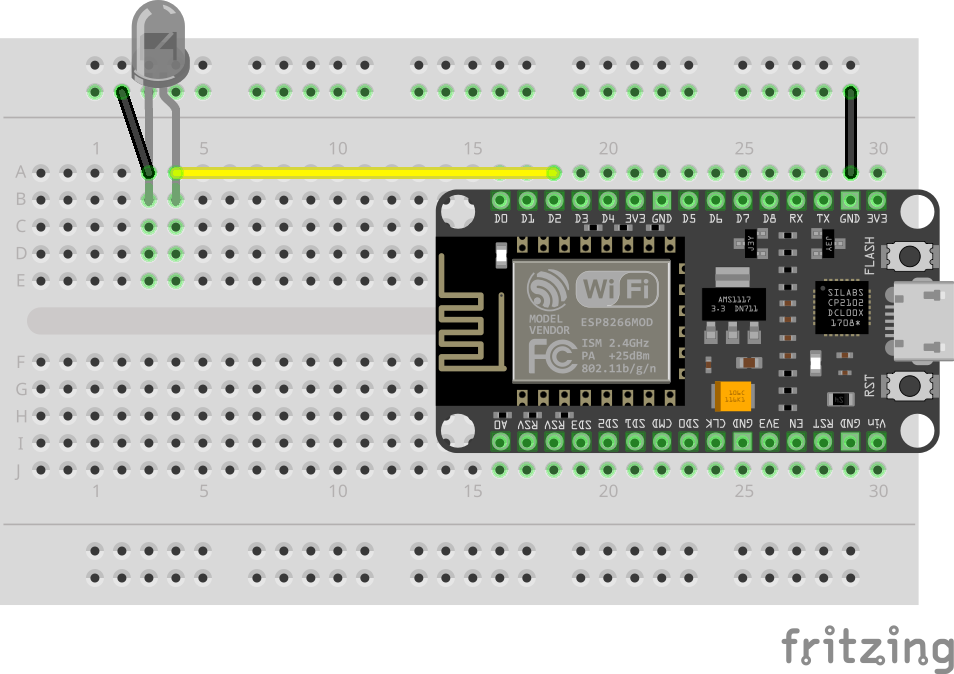
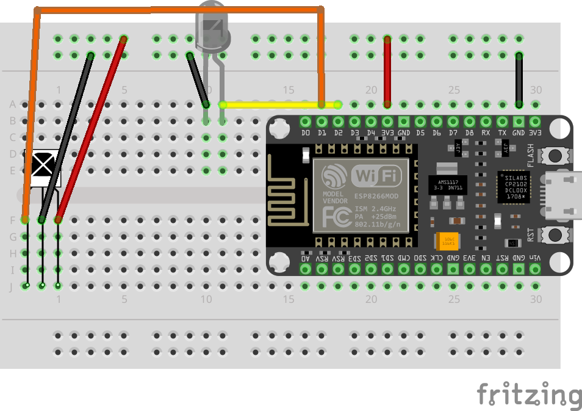

# Infrared Tripwire

In this lab, you’ll build an infrared “tripwire” using two NodeMCUs. One NodeMCU acts as a transmitter that constantly sends an IR “beam” (a repeating IR code). The other NodeMCU acts as a receiver that listens for that code. If the receiver stops hearing the code for more than a short time, it assumes the beam was interrupted and triggers an alarm LED.

> 🤝 This lab requires two NodeMCUs. Pair up:
> - Person A builds the Transmitter
> - Person B builds the Receiver

## Lab: Build an IR Tripwire

You will build and program two devices:
- **Transmitter:** continuously sends a known IR code using an IR LED\

- **Receiver:** expects to see that code repeatedly; if it disappears, the LED alarm turns on\


## Part A: Transmitter (sends the IR “beam”)

### Wiring Table (source → destination)

NodeMCU D2 (GPIO4) → IR LED anode (long leg)\
IR LED cathode (short leg) → GND

### Code (Transmitter)

```c++
#include <IRremoteESP8266.h>
#include <IRsend.h>

#define IR_LED D2 // GPIO4 (D2)

// IMPORTANT: This code must match what the receiver expects.
// Use the SAME value in both sketches.
#define TRIPWIRE_CODE 0xC0DEC0DE

IRsend irsend(IR_LED);

void setup() {
  Serial.begin(115200);
  delay(200);
  irsend.begin();
  Serial.println("IR Tripwire Transmitter Ready");
}

void loop() {
  irsend.sendNEC(TRIPWIRE_CODE);
  Serial.println("Transmitting...");
  delay(100);
}
```

[IR_Tripwire_Transmitter.ino](https://github.com/cjudd/hacking-infrared-workshop/blob/main/code/IR_Tripwire_Transmitter.ino)

This sketch configures an IR LED on D2 and continuously transmits the same IR message over and over. The device is acting like a “beacon”—as long as it’s running and aimed at the receiver, the receiver should repeatedly detect the same code.

## Part B: Receiver (detects beam interruption)

### Wiring Table (source → destination)

NodeMCU 3V3 → + rail
IR receiver VCC (+) → + rail
NodeMCU GND → - rail
IR receiver GND (–) → - rail
NodeMCU D1 (GPIO5) → IR receiver OUT / SIG
NodeMCU D2 (GPIO4) → LED anode (long leg)
LED cathode (short leg) → - rail

### Code (Receiver)

```c++
#include <IRremoteESP8266.h>
#include <IRrecv.h>

#define RECV_PIN D1 // GPIO5 (D1)
#define LED D2      // GPIO4 (D2)

// IMPORTANT: This code must match the transmitter.
#define TRIPWIRE_CODE 0xC0DEC0DE

IRrecv irrecv(RECV_PIN);
decode_results results;

unsigned long lastDetected = 0;
const unsigned long TIMEOUT = 500;

void setup() {
  Serial.begin(115200);
  delay(200);
  irrecv.enableIRIn();
  pinMode(LED, OUTPUT);
  Serial.println("IR Tripwire Receiver Ready");
}

void loop() {
  if (irrecv.decode(&results)) {
    if (results.value == TRIPWIRE_CODE) {
      lastDetected = millis();
      Serial.println("Beam OK");
    }
    irrecv.resume();
  }

  if (millis() - lastDetected > TIMEOUT) {
    digitalWrite(LED, HIGH);
    Serial.println("TRIPWIRE TRIGGERED!");
  } else {
    digitalWrite(LED, LOW);
  }

  delay(50);
}
```

[IR_Tripwire_Receiver.ino](https://github.com/cjudd/hacking-infrared-workshop/blob/main/code/IR_Tripwire_Receiver.ino)

This sketch listens for IR messages on D1 and tracks the last time the “beam code” was detected using `millis()`. If the receiver has not detected the expected code within the last 500 ms, it assumes the beam is broken and turns the LED on. When the code is detected again, it updates `lastDetected` and turns the LED off.

### Upload and Test

1. Place the two boards facing each other:
    * Aim the IR LED directly at the IR receiver
    * Start close (6–12 inches) and adjust later
1. Confirm normal operation:
    * When aligned, the receiver should report “Beam OK repeatedly and the LED should be OFF
1. Test the tripwire:
    * Move your hand or a notebook between the transmitter and receiver
    * The receiver LED should turn ON to indicate the tripwire is triggered

### Troubleshooting

* Nothing happens / receiver never sees the beam
    * Make sure the IR receiver wiring is correct (VCC, GND, OUT → D1).
    * Confirm the IR LED polarity (long leg/anode to D2).
    * Move boards closer and aim carefully—IR is directional.
    * Try reducing bright light / sunlight (it can interfere with IR).
* Tripwire triggers even when aligned
    * Increase the transmitter power by improving alignment and moving closer.
    * Increase TIMEOUT (e.g., from 500 to 1000) to be more tolerant:
        * `const unsigned long TIMEOUT = 1000;`
    * Decrease the transmitter delay (send more frequently):
        * change `delay(100)` to `delay(50)`
* Tripwire never triggers
    * Confirm you are actually blocking the beam path.
    * Increase `TIMEOUT` too much can make it slow to trigger—try 300–700ms.
* IMPORTANT: Code mismatch
    * The transmitter and receiver must use the exact same TRIPWIRE_CODE.
    * In your prompt, the codes were inconsistent (`0xC0DEC0DE` vs `0xDC0DEC0DE`). Use one value in both sketches (this lab uses `0xC0DEC0DE`).

---

1. [Receive IR](receive_ir.md)
1. [Transmit IR](transmit_ir.md)
1. [Proximity & Detection](proximity.md)
1. [Tripwire](tripwire.md)

[NEXT](../README.md)